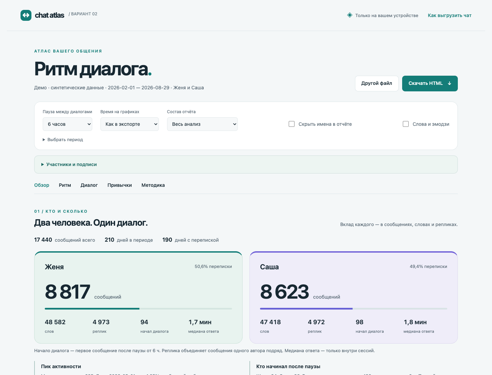

# Chat Atlas

Локальный эвристический анализ личной переписки Telegram. Выберите `result.json`, исследуйте ритм диалога и сохраните красивый автономный HTML. Без сервера, AI, аккаунтов, CDN и установки зависимостей.



Версия 0.2.0: имена участников, карточки вклада и интерактивная динамика. [Что изменилось](docs/VARIANT_02.md).

## Запуск

Откройте [`dist/index.html`](dist/index.html) в современном браузере. Файл можно перенести на другой компьютер; интернет не нужен. Кнопка **«Посмотреть демо»** загружает только синтетическую переписку.

Экспорт в Telegram Desktop: личный чат → ⋮ → **Экспорт истории чата** → формат **JSON**. Медиа скачивать необязательно. Выберите полученный `result.json` в Chat Atlas.

Поддерживается экспорт **одного личного чата**. Группы и общий архив аккаунта не поддерживаются. Лимит загрузки — 200 МБ. Исходные данные анализируются в Web Worker, чтобы не блокировать интерфейс.

## Что в отчёте

- Количество сообщений по дням для каждого участника, дни тишины, скользящее среднее за 7 дней.
- Последние 7 полных дней против предыдущих 28: относительное и абсолютное изменение средней активности. Крайние дни исключены.
- Инициаторы сессий после паузы 2 / 6 / 12 / 24 часа, помесячная динамика и чувствительность к порогу.
- Медиана и 90-й перцентиль задержки ответа между репликами, число наблюдений, доля ответов до 5 минут.
- Сообщения, слова, вопросы, ссылки, пересылки, Telegram replies, реакции, редактирования.
- Активность по часам и дням недели, серия активных дней, самая длинная наблюдаемая пауза.
- Фото, голосовые, видеокружки и другие вложения; суммарная длительность аудио и видео при наличии метаданных.
- Опциональные частые слова и эмодзи отдельно по участникам: весь расчёт остаётся локальным.
- Карточки вклада каждого человека вместо индексов: сообщения, доля, слова, реплики, начала диалогов и медиана ответа.
- Исследование графика: сообщения/слова/начала, объём/по людям/доли, сглаживание 1/7/14/28 дней. Переключатели работают и в сохранённом HTML.
- Изменение темпа отдельно по людям, сравнение 7/14/28 дней с предыдущими 28 и заметные исторические изменения.

Режимы: **весь анализ**, **краткий обзор**, **ритм и динамика**, **инициатива и ответы**. Настраиваются диапазон дат, часовой пояс, порог паузы и скрытие имён.

## Как трактовать цифры

Это статистика наблюдаемой переписки, а не измерение чувств, интереса или качества отношений. Паузы могут быть вызваны сном, работой, звонками или общением вне Telegram. Экспорт может быть неполным. Начало первого видимого сеанса неизвестно и не учитывается в инициативах. Время до ответа не равно времени прочтения.

[Методика и определения](docs/METHODOLOGY.md) · [Обзор открытых аналогов](docs/ALTERNATIVES.md)

## Приватность

- JSON остаётся в памяти браузера. Нет сетевых запросов, аналитики, cookies, localStorage или загрузки на сервер.
- В браузерном варианте по умолчанию показаны последние известные имена из JSON. Раздел «Участники и подписи» позволяет переименовать их; ID обеспечивают стабильную привязку и не сохраняются в отчёт. «Скрыть имена в отчёте» заменяет подписи на A/B. CLI сохраняет прежний анонимный режим по умолчанию.
- Скачанный отчёт содержит агрегаты и, если вы отключили скрытие, имена. При включении «Слова и эмодзи» сохраняются также их частоты. Полных текстов сообщений, Telegram ID, адресов ссылок и путей к медиа в нём нет.
- Агрегаты и даты тоже могут быть личными данными. Проверьте отчёт перед передачей другим людям.
- Кнопка «Другой файл» освобождает worker и данные предыдущего анализа. Обновление или закрытие вкладки также очищает сессию.
- Частные экспорты и отчёты исключены через `.gitignore`. Не помещайте их в `dist/`, `src/` или другие публичные каталоги.

## Запуск командой

При установленном Node.js 20+ можно сформировать тот же отчёт без браузерного интерфейса:

```sh
node scripts/analyze.mjs "/path/to/result.json" --out report.html
node scripts/analyze.mjs "/path/to/result.json" --out report.html --words --gap 12 --force
node scripts/analyze.mjs --help
```

По умолчанию имена скрыты, лексика выключена. `--names` сохраняет имена, `--words` добавляет частые слова/эмодзи. Существующий файл не перезаписывается без `--force`. Дополнительные опции: `--timezone`, `--from`, `--to`, `--mode`. Интернет и сервер обработки не нужны.

## Разработка

Требуется Node.js 20+. Сторонних пакетов нет; `npm install` не нужен.

```sh
npm test
npm run build
npm start
```

Сервер доступен только локально: `http://127.0.0.1:4173`. После изменения исходников повторите сборку. `dist/index.html` — единственный файл для запуска и распространения.

```text
src/engine.js            расчёты и нормализация Telegram JSON
src/report.js            HTML и SVG из агрегатов
src/explore.js           интерактивные графики из дневных агрегатов
src/document.js          общий автономный HTML для браузера и CLI
src/app.js               загрузка, worker, настройки, экспорт HTML
src/styles.css          оформление и печать
src/demo.js              воспроизводимые синтетические данные
scripts/build.mjs        сборка автономной страницы
scripts/analyze.mjs      запуск анализа командой
scripts/serve.mjs        необязательный локальный сервер
```

[Публикация на GitHub с вашим авторством](docs/PUBLISH.md)

## Лицензия

MIT. См. [LICENSE](LICENSE).
